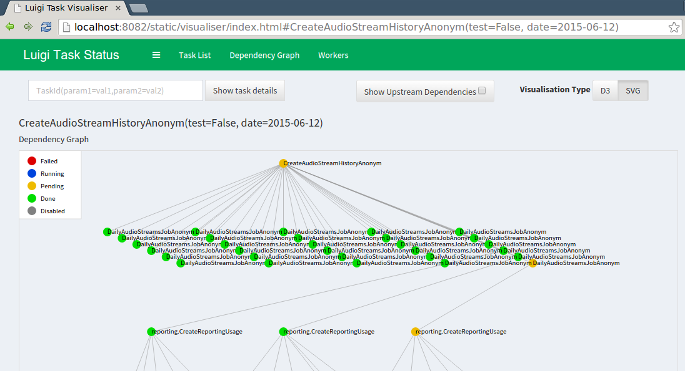

Using the Central Scheduler
---------------------------

While the ``--local-scheduler`` flag is useful for development purposes,
it's not recommended for production usage.
The centralized scheduler serves two purposes:

-  Make sure two instances of the same task are not running simultaneously
-  Provide visualization of everything that's going on.

Note that the central scheduler does not execute anything for you or
help you with job parallelization.
For running tasks periodically,
the easiest thing to do is to trigger a Python script from cron or
from a continuously running process.
There is no central process that automatically triggers jobs.
This model may seem limited, but
we believe that it makes things far more intuitive and easy to understand.

The luigid server
~~~~~~~~~~~~~~~~~

To run the server as a daemon run:

.. code-block:: console

    $ luigid --background --pidfile <PATH_TO_PIDFILE> --logdir <PATH_TO_LOGDIR> --state-path <PATH_TO_STATEFILE>

Note that this requires ``python-daemon``.
By default, the server starts on AF_INET and AF_INET6 port ``8082``
(which can be changed with the ``--port`` flag) and listens on all IPs. To change the default behavior of listening on all IPs, pass the ``--address`` flag and the IP address to listen on.
To use an AF_UNIX socket use the ``--unix-socket`` flag.

For a full list of configuration options and defaults,
see the :ref:`scheduler configuration section <scheduler-config>`.
Note that ``luigid`` uses the same configuration files as the Luigi client
(i.e. ``luigi.cfg`` or ``/etc/luigi/client.cfg`` by default).

.. _TaskHistory:

Enabling Task History
~~~~~~~~~~~~~~~~~~~~~

Task History is an experimental feature in which
additional information about tasks that have been executed are recorded in a relational database
for historical analysis.
This information is exposed via the Central Scheduler at ``/history``.

To enable the task history,
specify ``record_task_history = True`` in the
``[scheduler]`` section of ``luigi.cfg`` and
specify ``db_connection`` under ``[task_history]``.
The ``db_connection`` string is used to configure the `SQLAlchemy engine
<http://docs.sqlalchemy.org/en/rel_0_9/core/engines.html>`_.
When starting up,
``luigid`` will create all the necessary tables using `create_all
<http://docs.sqlalchemy.org/en/rel_0_9/core/metadata.html#sqlalchemy.schema.MetaData.create_all>`_.

Example configuration

.. code:: ini

    [scheduler]
    record_task_history = True
    state_path = /usr/local/var/luigi-state.pickle

    [task_history]
    db_connection = sqlite:////usr/local/var/luigi-task-hist.db

The task history has the following pages:

* ``/history``
  a reverse-cronological listing of runs from the past 24 hours.
  Example screenshot:

    .. figure:: history.png
       :alt: Recent history screenshot
* ``/history/by_id/{id}``
  detailed information about a run, including:
  parameter values, the host on which it ran, and timing information.
  Example screenshot:

    .. figure:: history_by_id.png
       :alt: By id screenshot
* ``/history/by_name/{name}``
  a listing of all runs of a task with the given task ``{name}``.
  Example screenshot:

    .. figure:: history_by_name.png
       :alt: By name screenshot
* ``/history/by_params/{name}?data=params``
  a listing of all runs of the task ``{name}`` restricted to runs with ``params`` matching the given history.
  The ``params`` is a json blob describing the parameters,
  e.g. ``data={"foo": "bar"}`` looks for a task with ``foo=bar``.
