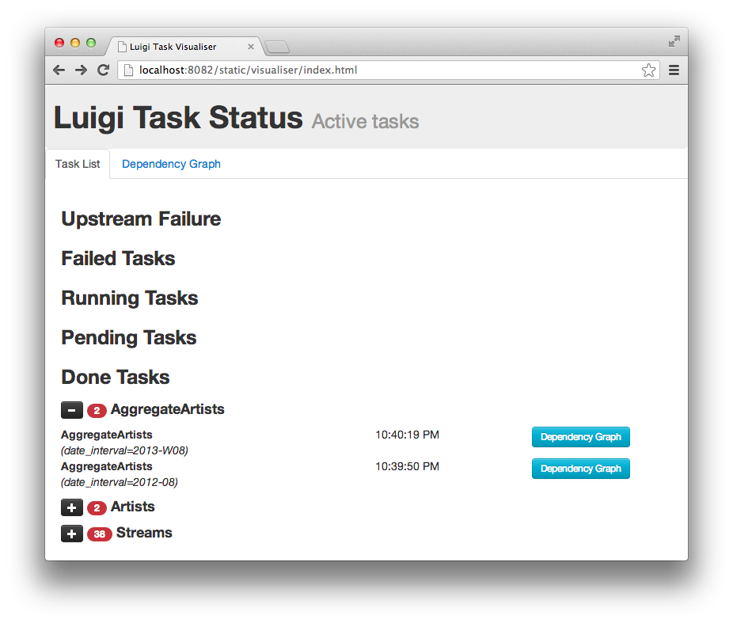

Example – Top Artists
---------------------

This is a very simplified case of something we do at Spotify a lot.
All user actions are logged to Google Cloud Storage (previously HDFS) where
we run a bunch of processing jobs to transform the data. The processing code itself is implemented
in a scalable data processing framework, such as Scio, Scalding, or Spark, but the jobs
are orchestrated with Luigi.
At some point we might end up with
a smaller data set that we can bulk ingest into Cassandra, Postgres, or
other storage suitable for serving or exploration.

For the purpose of this exercise, we want to aggregate all streams,
find the top 10 artists and then put the results into Postgres.

This example is also available in
`examples/top_artists.py <https://github.com/spotify/luigi/blob/master/examples/top_artists.py>`_.

Step 1 - Aggregate Artist Streams
~~~~~~~~~~~~~~~~~~~~~~~~~~~~~~~~~

.. code:: python

    class AggregateArtists(luigi.Task):
        date_interval = luigi.DateIntervalParameter()

        def output(self):
            return luigi.LocalTarget("data/artist_streams_%s.tsv" % self.date_interval)

        def requires(self):
            return [Streams(date) for date in self.date_interval]

        def run(self):
            artist_count = defaultdict(int)

            for input in self.input():
                with input.open('r') as in_file:
                    for line in in_file:
                        timestamp, artist, track = line.strip().split()
                        artist_count[artist] += 1

            with self.output().open('w') as out_file:
                for artist, count in artist_count.iteritems():
                    print >> out_file, artist, count

Note that this is just a portion of the file ``examples/top_artists.py``.
In particular, ``Streams`` is defined as a :class:`~luigi.task.Task`,
acting as a dependency for ``AggregateArtists``.
In addition, ``luigi.run()`` is called if the script is executed directly,
allowing it to be run from the command line.

There are several pieces of this snippet that deserve more explanation.

-  Any :class:`~luigi.task.Task` may be customized by instantiating one
   or more :class:`~luigi.parameter.Parameter` objects on the class level.
-  The :func:`~luigi.task.Task.output` method tells Luigi where the result
   of running the task will end up. The path can be some function of the
   parameters.
-  The :func:`~luigi.task.Task.requires` tasks specifies other tasks that
   we need to perform this task. In this case it's an external dump named
   *Streams* which takes the date as the argument.
-  For plain Tasks, the :func:`~luigi.task.Task.run` method implements the
   task. This could be anything, including calling subprocesses, performing
   long running number crunching, etc. For some subclasses of
   :class:`~luigi.task.Task` you don't have to implement the ``run``
   method. For instance, for the :class:`~luigi.contrib.hadoop.JobTask`
   subclass you implement a *mapper* and *reducer* instead.
-  :class:`~luigi.LocalTarget` is a built in class that makes it
   easy to read/write from/to the local filesystem. It also makes all file operations
   atomic, which is nice in case your script crashes for any reason.

Running this Locally
~~~~~~~~~~~~~~~~~~~~

Try running this using eg.

.. code-block:: console

    $ cd examples
    $ luigi --module top_artists AggregateArtists --local-scheduler --date-interval 2012-06

Note that  *top_artists* needs to be in your PYTHONPATH, or else this can produce an error (*ImportError: No module named top_artists*). Add the current working directory to the command PYTHONPATH with:

.. code-block:: console

    $ PYTHONPATH='.' luigi --module top_artists AggregateArtists --local-scheduler --date-interval 2012-06

You can also try to view the manual using ``--help`` which will give you an
overview of the options.

Running the command again will do nothing because the output file is
already created.
In that sense, any task in Luigi is *idempotent*
because running it many times gives the same outcome as running it once.
Note that unlike Makefile, the output will not be recreated when any of
the input files is modified.
You need to delete the output file
manually.

The ``--local-scheduler`` flag tells Luigi not to connect to a scheduler
server. This is not recommended for other purpose than just testing
things.

Step 1b - Aggregate artists with Spark
~~~~~~~~~~~~~~~~~~~~~~~~~~~~~~~~~~~~~~

While Luigi can process data inline, it is normally used to orchestrate external programs that
perform the actual processing. In this example, we will demonstrate how top artists instead can be
read from HDFS and calculated with Spark, orchestrated by Luigi.

.. code:: python

    class AggregateArtistsSpark(luigi.contrib.spark.SparkSubmitTask):
        date_interval = luigi.DateIntervalParameter()

        app = 'top_artists_spark.py'
        master = 'local[*]'

        def output(self):
            return luigi.contrib.hdfs.HdfsTarget("data/artist_streams_%s.tsv" % self.date_interval)

        def requires(self):
            return [StreamsHdfs(date) for date in self.date_interval]

        def app_options(self):
            # :func:`~luigi.task.Task.input` returns the targets produced by the tasks in
            # `~luigi.task.Task.requires`.
            return [','.join([p.path for p in self.input()]),
                    self.output().path]

:class:`luigi.contrib.hadoop.SparkSubmitTask` doesn't require you to implement a
:func:`~luigi.task.Task.run` method. Instead, you specify the command line parameters to send
to ``spark-submit``, as well as any other configuration specific to Spark.

Python code for the Spark job is found below.

.. code:: python

    import operator
    import sys
    from pyspark.sql import SparkSession

    def main(argv):
        input_paths = argv[1].split(',')
        output_path = argv[2]

        spark = SparkSession.builder.getOrCreate()

        streams = spark.read.option('sep', '\t').csv(input_paths[0])
        for stream_path in input_paths[1:]:
            streams.union(spark.read.option('sep', '\t').csv(stream_path))

        # The second field is the artist
        counts = streams \
            .map(lambda row: (row[1], 1)) \
            .reduceByKey(operator.add)

        counts.write.option('sep', '\t').csv(output_path)

    if __name__ == '__main__':
        sys.exit(main(sys.argv))

In a typical deployment scenario, the Luigi orchestration definition above as well as the
Pyspark processing code would be packaged into a deployment package, such as a container image. The
processing code does not have to be implemented in Python, any program can be packaged in the
image and run from Luigi.

Step 2 – Find the Top Artists
~~~~~~~~~~~~~~~~~~~~~~~~~~~~~

At this point, we've counted the number of streams for each artists,
for the full time period.
We are left with a large file that contains
mappings of artist -> count data, and we want to find the top 10 artists.
Since we only have a few hundred thousand artists, and
calculating artists is nontrivial to parallelize,
we choose to do this not as a Hadoop job, but just as a plain old for-loop in Python.

.. code:: python

    class Top10Artists(luigi.Task):
        date_interval = luigi.DateIntervalParameter()
        use_hadoop = luigi.BoolParameter()

        def requires(self):
            if self.use_hadoop:
                return AggregateArtistsSpark(self.date_interval)
            else:
                return AggregateArtists(self.date_interval)

        def output(self):
            return luigi.LocalTarget("data/top_artists_%s.tsv" % self.date_interval)

        def run(self):
            top_10 = nlargest(10, self._input_iterator())
            with self.output().open('w') as out_file:
                for streams, artist in top_10:
                    print >> out_file, self.date_interval.date_a, self.date_interval.date_b, artist, streams

        def _input_iterator(self):
            with self.input().open('r') as in_file:
                for line in in_file:
                    artist, streams = line.strip().split()
                    yield int(streams), int(artist)

The most interesting thing here is that this task (*Top10Artists*)
defines a dependency on the previous task (*AggregateArtists*).
This means that if the output of *AggregateArtists* does not exist,
the task will run before *Top10Artists*.

.. code-block:: console

    $ luigi --module examples.top_artists Top10Artists --local-scheduler --date-interval 2012-07

This will run both tasks.

Step 3 - Insert into Postgres
~~~~~~~~~~~~~~~~~~~~~~~~~~~~~

This mainly serves as an example of a specific subclass *Task* that
doesn't require any code to be written.
It's also an example of how you can define task templates that
you can reuse for a lot of different tasks.

.. code:: python

    class ArtistToplistToDatabase(luigi.contrib.postgres.CopyToTable):
        date_interval = luigi.DateIntervalParameter()
        use_hadoop = luigi.BoolParameter()

        host = "localhost"
        database = "toplists"
        user = "luigi"
        password = "abc123"  # ;)
        table = "top10"

        columns = [("date_from", "DATE"),
                   ("date_to", "DATE"),
                   ("artist", "TEXT"),
                   ("streams", "INT")]

        def requires(self):
            return Top10Artists(self.date_interval, self.use_hadoop)

Just like previously, this defines a recursive dependency on the
previous task. If you try to build the task, that will also trigger
building all its upstream dependencies.

Using the Central Planner
~~~~~~~~~~~~~~~~~~~~~~~~~

The ``--local-scheduler`` flag tells Luigi not to connect to a central scheduler.
This is recommended in order to get started and or for development purposes.
At the point where you start putting things in production
we strongly recommend running the central scheduler server.
In addition to providing locking
so that the same task is not run by multiple processes at the same time,
this server also provides a pretty nice visualization of your current work flow.

If you drop the ``--local-scheduler`` flag,
your script will try to connect to the central planner,
by default at localhost port 8082.
If you run

.. code-block:: console

    $ luigid

in the background and then run your task without the ``--local-scheduler`` flag,
then your script will now schedule through a centralized server.
You need `Tornado <http://www.tornadoweb.org/>`__ for this to work.

Launching http://localhost:8082 should show something like this:

Web server screenshot
Looking at the dependency graph
for any of the tasks yields something like this:

Aggregate artists screenshot

In production, you'll want to run the centralized scheduler.
See: :doc:`central_scheduler` for more information.
